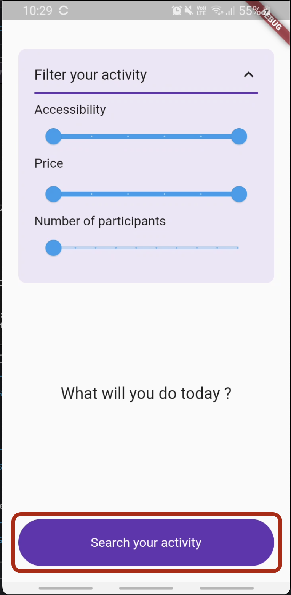
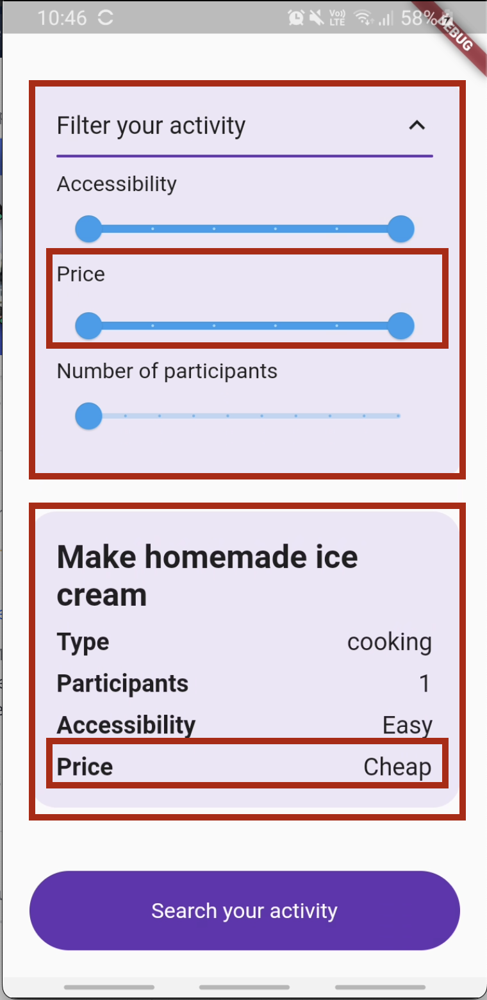

# codelab_flutter_at_octo

Le but de ce projet est de donner des exemples d'implémentations des concepts de développement que l'on met en place chez OCTO dans le contexte d'une app en flutter.

Il est donc, si ce n'est nécessaire, vivement conseillé de suivre auparavant les codelabs suivant pour monter en compétences sur le framework en lui même: 
 - [Lab: Write your first Flutter app](https://docs.flutter.dev/get-started/codelab)
 - [Basic Flutter layout concepts](https://docs.flutter.dev/codelabs/layout-basics)

Il est également conseillé d'utiliser Android Studio étant donné que c'est l'outil principal utilisé par les OCTOs.

## Getting Started

Le point de départ de ce projet est une application qui permet de trouver une activité à faire en fonction de certains critères. 
Cette activité est retournée par un appel API (voir lignes 218 à 226 de basic_activity_page.dart).
Partant de ce point de départ, nous allons refactorer ce fichier en suivant différentes guidelines :
 1. Extraction des différents composants graphiques dans des Widgets.
 2. Extraction des différents styles de textes et autres constantes.
 3. Extraction de l'appel réseau dans un repository et test du repository.
 4. Implémentation suivant l'architecture REDUX
    1. Injection de dépendances et création du state
    2. Création du middleware et de l'action de get
    3. Création du reducer et de l'action de process
    4. Création du viewModel et affichage
 5. Implémentation suivant l'architecture XXX
    1. TODO


### Extraction des différents composants graphiques dans des Widgets.
Branche de départ : master

Pourquoi ce refacto ?
Par soucis de lisibilité et de maintenabilité, il est recommandé de ne pas laisser nos classes atteindre des tailles trop importantes.  
Nous conseillons donc de procéder à un découpage le plus fin possible allant de notre page (`BasicActivityPage` dans notre example) à des widget atomiques (comme un bouton).
En découpant de cette manière, nous pourrons également réutiliser très simplement ces composants dans la même page et/ou sur d'autres écrans.

Comment ?
Tout d'abord, nous allons identifier sur l'écran quel composant extraire, dans notre cas ce sera le bouton du bas


L'idée est de créer un `StatelessWidget` ayant dans sa methode build la chaine de Widgets correspondant à notre bouton.
Dans notre cas les lignes 206 à 252.
Ensuite, nous allons définir quels champs sont sensés être parametrables dans ce widget. En suivant si possible l'exemple (et le nommage) des composants du framework. 
Ici, nous aurons donc un paramètre `onTap` comme dans le composant `Inkwell`, et un paramètre `label`: 

codelab_button.dart
```dart
import 'package:flutter/material.dart';

class CodelabButton extends StatelessWidget {
  final void Function() onTap;
  final String label;

  const CodelabButton({
    super.key,
    required this.onTap,
    required this.label,
  });

  @override
  Widget build(BuildContext context) {
    return ClipRRect(
      borderRadius: BorderRadius.circular(60),
      child: Material(
        color: Colors.deepPurple,
        child: InkWell(
          onTap: onTap,
          child: Container(
            padding: const EdgeInsets.symmetric(vertical: 20),
            child: Center(
              child: Text(
                label,
                style: const TextStyle(fontSize: 16, color: Colors.white),
              ),
            ),
          ),
        ),
      ),
    );
  }
}
```

Il ne nous reste ensuite plus qu'à l'utiliser dans basic_activity_page.dart, puis à appliquer le même principe à nos autres composants



Pour voir l'implémentation finale, checkout fin_extraction_widgets

### Extraction des différents styles de textes et autres constantes.
Dans une logique de factorisation et d'uniformisation de notre UI, nous conseillons aussi de centraliser dans des fichiers dédiés, les différents types de typo et de couleurs que l'app peut utiliser. 
Il est également conseillé dans la mesure du possible de faire correspondre ces couleurs avec les nommages utilisés par les deisgners.

Dans notre cas nous allons donc créer deux fichiers :
 - codelab_colors.dart
```dart
class CodelabColors {
  static const primary = Color(0xFF673AB7);
  static const primaryLight = Color(0xFFEDE7F6); 
}
```
 - codelabs_text_styles.dart
```dart
class CodelabTextStyles {
  static const text24_bold_black = TextStyle(fontSize: 24, fontWeight: FontWeight.bold);
  static const text20_black = TextStyle(fontSize: 20);
  static const text18_bold_black = TextStyle(fontSize: 18, fontWeight: FontWeight.bold);
  static const text18_black = TextStyle(fontSize: 18);
  static const text16_black = TextStyle(fontSize: 16);
}
```

Pour voir l'implémentation finale, checkout fin_extraction_constants_ui


## Architecture logicielle
Dans la suite de ce codelab, nous allons détailler différentes manières que nous avons d'architecturer notre code. Le tout pour répondre à 4 problématiques principales : 
 - Lisibilité : pouvoir rapidement comprendre le rôle de chacune de nos classes.
 - Testabilité : pouvoir s'assurer d'avoir un harnais de tests efficace permettant d'ajouter de nouvelles features sans risquer de casser les anciennes.
 - Maintenabilité : pouvoir simplement et rapidement identifier à quel endroit, et de quelle manière apporter une modification / correction. 
 - Réutilisabilité : pouvoir réutiliser une brique logicielle à différents endroits sans avoir à la dupliquer.

Chez OCTO, quelque soit la technologie, différents types d'architectures sont possibles, mais les principes guidants le choix de cette architecture restent les mêmes.

### Extraction de l'appel réseau dans un repository et test du repository.
Lorsque nous procédons à des appels réseaux, nous conseillons de toujours d'isoler la partie réseau dans une classe à part, et nous la nommons la plupart du temps repository.
Dans l'optique de rendre cette classe facile à tester, nous allons lui injecter un client réseau, qui sera mocké dans les tests.
Pour le reste, la classe est reponsable de l'appel réseau, de la déserialization de la réponse et de sa transformation en objet métier.

Dans notre cas on aura :
activity_repository.dart
```dart
import 'dart:convert';

import 'package:codelab_flutter_at_octo/activity.dart';
import 'package:flutter/material.dart';
import 'package:http/http.dart';

class ActivityRepository {
  final Client httpClient;

  ActivityRepository(this.httpClient);

  /// Will return null in case of error
  Future<Activity?> getActivity(RangeValues priceRangeValue, RangeValues accessibilityRangeValue, int participants) async {
    try {
      final priceSuffix = '&minprice=${priceRangeValue.start / 100}&maxprice=${priceRangeValue.end / 100}';
      final accessibilitySuffix =
          '&minaccessibility=${accessibilityRangeValue.start / 100}&maxaccessibility=${accessibilityRangeValue.end /
          100}';
      var uri =
          'https://www.boredapi.com/api/activity?participants=${participants
          .toString()}$priceSuffix$accessibilitySuffix';
      final url = Uri.parse(uri);
      final response = await httpClient.get(url);
      final json = jsonDecode(response.body);
      return Activity(
        label: json['activity'] as String,
        type: json['type'] as String,
        participants: (json['participants'] as num).toInt(),
        price: (json['price'] as num).toDouble() * 100,
        accessibility: (json['accessibility'] as num).toDouble() * 100,
      );
    } catch (e) {
      return null;
    }
  }
}
```

Une fois ce repository créé, on peut lui affecter une classe de test.
Par convention, en flutter, les tests sont dans un fichier sous le format nom_implementation_test.dart
Donc pour nous activity_repository_test.dart

La lib réseau utilisée ici (http) nous fournit un `MockClient` permettant de simuler une réponse du réseau : 
```dart
final client = MockClient((request) async {
  path = request.url.toString();
  return Response(
    """
    {
      "activity": "Learn how to iceskate or rollerskate",
      "type": "recreational",
      "participants": 1,
      "price": 0.1,
      "link": "",
      "key": "5947957",
      "accessibility": 0.25
    }
    """,
    200,
    headers: {'content-type': 'application/json'},
  );
});
```

Petite précision, sur dart, les classes n'ont pas de methodes equals permettant de les comparer par défaut.
Ainsi, deux instances d'une même classes seront toujours considérées comme différentes si on n'override pas leur methode equals.
Pour éviter de le faire à la main, nous utilisons habituellement la lib [Equatable](https://pub.dev/packages/equatable)
Et nous pourrons ainsi simplement faire une comparaison à l'aide d'un expect dans notre test.

Ensuite, c'est du classique Given When Then, comme sur chaque projet.

Pour voir l'implémentation finale, checkout fin_extract_repository