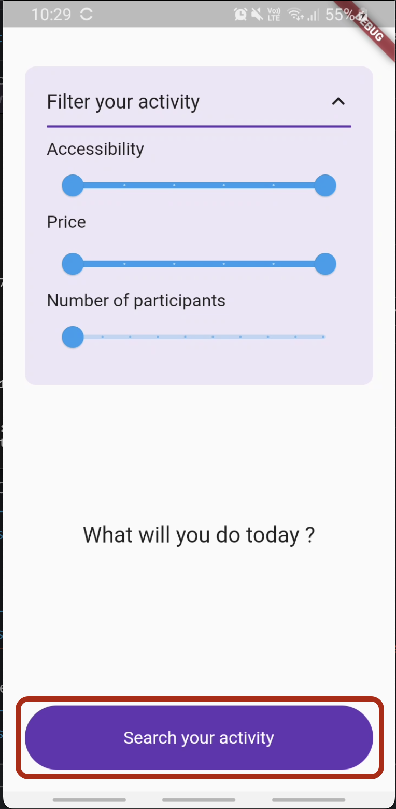
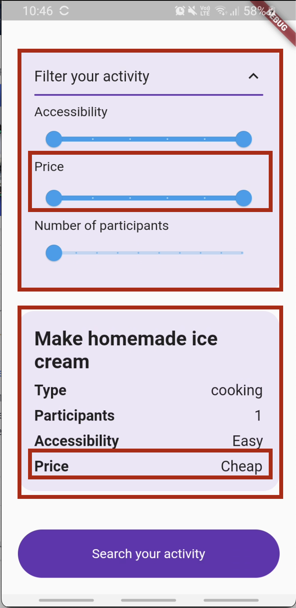

# 1. Extraction des différents composants graphiques dans des Widgets.
Branche de départ : `master`

Pourquoi ce refacto ?
Par soucis de lisibilité et de maintenabilité, il est recommandé de ne pas laisser nos classes atteindre des tailles trop importantes.  
Nous conseillons donc de procéder à un découpage le plus fin possible allant de notre page (`BasicActivityPage` dans notre example) à des widget atomiques (comme un bouton).
En découpant de cette manière, nous pourrons également réutiliser très simplement ces composants dans la même page et/ou sur d'autres écrans.

Comment ?
Tout d'abord, nous allons identifier sur l'écran quel composant extraire, dans notre cas ce sera le bouton du bas


L'idée est de créer un `StatelessWidget` ayant dans sa methode build la chaine de Widgets correspondant à notre bouton.
Dans notre cas les lignes 206 à 252.
Ensuite, nous allons définir quels champs sont sensés être parametrables dans ce widget. En suivant si possible l'exemple (et le nommage) des composants du framework. 
Ici, nous aurons donc un paramètre `onTap` comme dans le composant `Inkwell`, et un paramètre `label`: 

codelab_button.dart
```dart
import 'package:flutter/material.dart';

class CodelabButton extends StatelessWidget {
  final void Function() onTap;
  final String label;

  const CodelabButton({
    super.key,
    required this.onTap,
    required this.label,
  });

  @override
  Widget build(BuildContext context) {
    return ClipRRect(
      borderRadius: BorderRadius.circular(60),
      child: Material(
        color: Colors.deepPurple,
        child: InkWell(
          onTap: onTap,
          child: Container(
            padding: const EdgeInsets.symmetric(vertical: 20),
            child: Center(
              child: Text(
                label,
                style: const TextStyle(fontSize: 16, color: Colors.white),
              ),
            ),
          ),
        ),
      ),
    );
  }
}
```

Il ne nous reste ensuite plus qu'à l'utiliser dans `basic_activity_page.dart`, puis à appliquer le même principe à nos autres composants



Pour voir l'implémentation finale, checkout `fin_extraction_widgets`

## La suite 👉 Partie 2: [Extraction des différents styles de textes et autres constantes.](doc/step2.md)